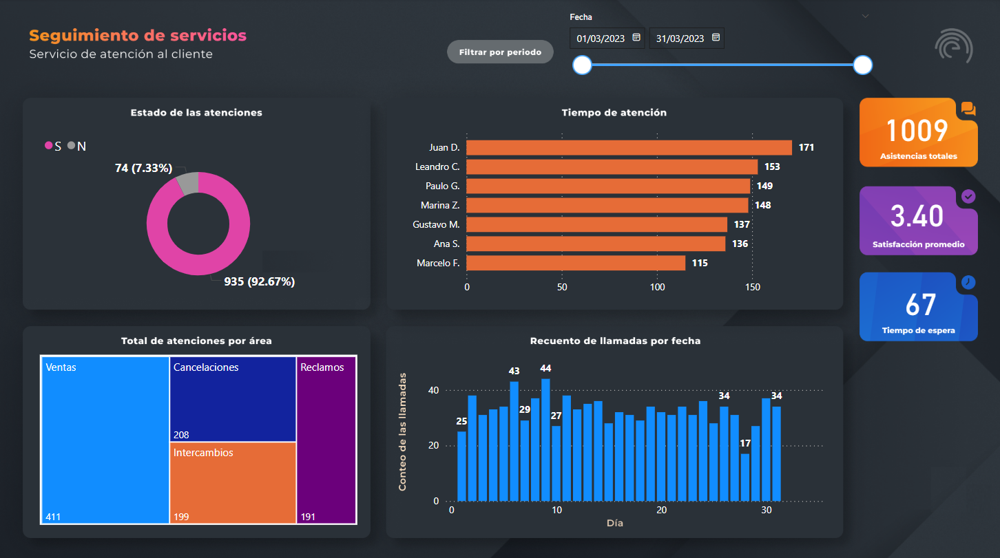

# **Seguimiento de Servicios - Análisis de Atención al Cliente** 📊

## **Descripción**  
Este proyecto ofrece un análisis interactivo del servicio de atención al cliente con Power BI. Permite visualizar métricas clave como tiempos de atención, volumen de consultas por área y satisfacción del cliente.

## **Características Principales**  
- **📈 Estado de las Atenciones**: Muestra el porcentaje de atenciones completadas frente a las activas.  
- **👨‍💻 Desempeño por Agente**: Visualiza el tiempo de atención de cada agente.  
- **🛠️ Atenciones por Área**: Desglosa las consultas por área (Ventas, Cancelaciones, Reclamos).  
- **📅 Reciente de Llamadas por Fecha**: Muestra el recuento de llamadas diarias.  
- **🔑 Métricas Clave**:  
  - **Asistencias Totales**: 1009  
  - **Satisfacción Promedio**: 3.40  
  - **Tiempo de Espera Promedio**: 67 segundos
    ## **Archivo Power BI**  
El archivo de Power BI con el análisis se encuentra en la carpeta [powerbi](powerbi/).

